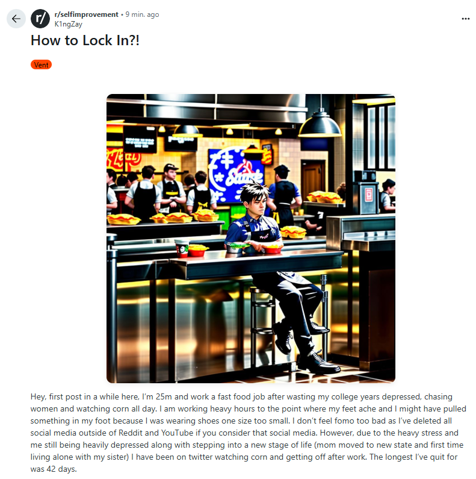
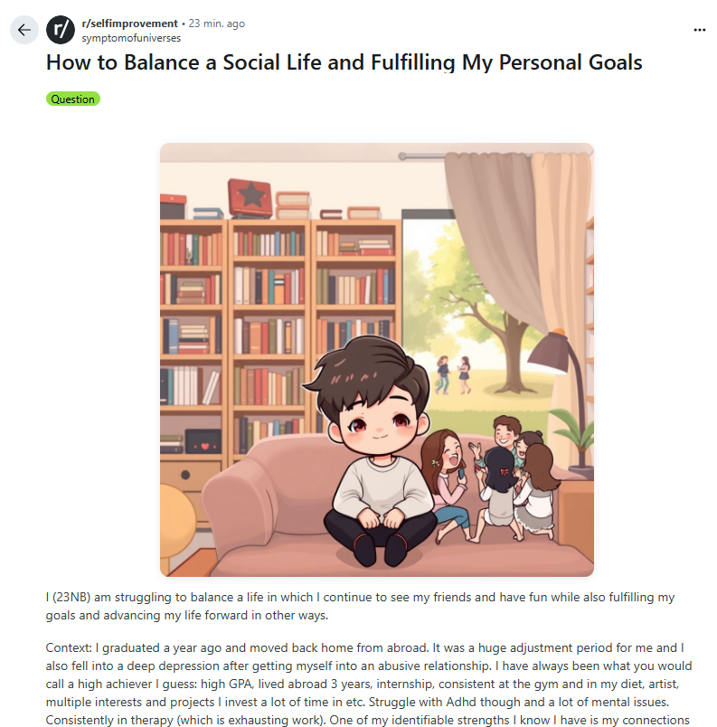
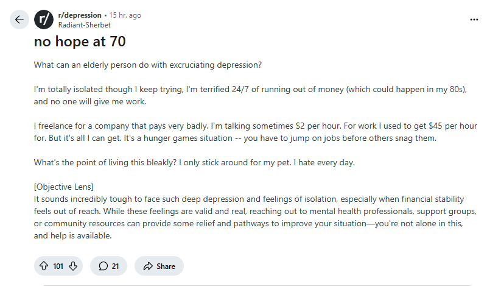
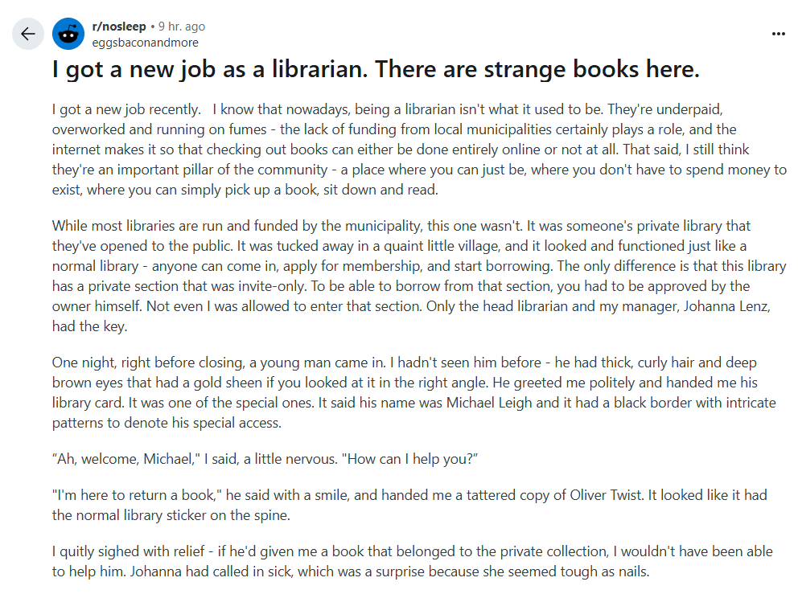
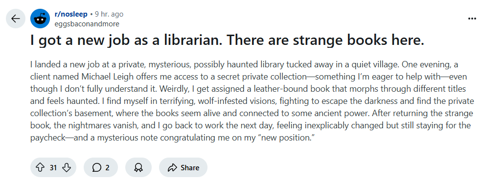

# ReddLens

Ever find yourself doomscrolling Reddit and thinking, “Why is everything here either depressing, biased, or 8 paragraphs too long?” Same. That’s why we built ReddLens – your all-in-one chrome extension lens for Reddit posts.

Slap on one (or all) of these 5 chaotic-good lenses:

🧙‍♂️ Mage Lens 
- Tired of using your imagination? Let this lens generate an AI image based on the post so you can finally see what that “shower thought” would look like if it had a face. You’re welcome, visual learners. Uses a free image api (pollinations ai) so image might not be the best.

🌈 Positive Lens
- For when Reddit's negativity is bleeding into your soul. This lens rewrites those self-pity posts and ragebait titles into something that doesn’t make you want to eat drywall. Like therapy, but sassier.

⚖️ Objective Lens
- Some people post their opinions like they’re divine truth. This lens slaps a reality check brief underneath and goes, “Hey, this is kinda biased. Chill.” Great for spotting drama queens in the wild.

📉 TL;DR Lens
- You saw 8 paragraphs (if you're lucky they even paragraph) and instantly scrolled to the comments, didn’t you? This one’s for you, king/queen of “ain't reading all that” Auto-summarizes the post into digestible chunks so you can pretend you actually read it before starting an argument.

🤣 Funny Lens
- Because you need more serotonin than Reddit provides. This lens roasts, rewrites, and reboots the post with a dash of humor so even serious rants turn into comedy gold. Now you can laugh at someone's life crisis and not feel bad.

## 📸 Screenshots

### 🔧 Function 1

  
  

---

### 🎯 Function 3

  

---

### 🧠 Function 4 – Original vs Summary

  
  

## Authors

- [@Ang-Wei-Liang](https://www.github.com/Ang-Wei-Liang)

